# AI-ERP with n8n — Graduation Project

A small, no-code ERP for a fictional Israeli electronics business (**AL Electronics
Solution**), built on **n8n** (automation + AI agents + RAG), **Airtable** (data),
and a web admin app built in **Base44**. Full course brief:
[`final-project-spec.docx`](./final-project-spec.docx).

## Three layers

| Layer   | Where             | Role                                                       |
|---------|-------------------|--------------------------------------------------------------|
| Data    | Airtable (cloud)  | 4 tables in use (of a 14-table model) — single source of truth |
| Logic   | n8n               | 10 workflows + 3 AI agents + an in-memory vector store (RAG) |
| UI      | Base44            | store front-end, admin dashboard, chat widget                |

## Implementation note

The workflows in this repo were built and are running on the team's live n8n
instance (not a separate sandboxed instance) — the exported JSON in
[`workflows/`](./workflows/) is a full, working snapshot of the 10 published
workflows described below, one-to-one.

## The 10 workflows

| # | Workflow | Trigger | What it does |
|---|----------|---------|---------------|
| 1 | [Tax Validation](workflows/PMO-1-Tax-Validation.json) | New Invoice/Tax-Invoice/Receipt in Airtable | Validates the record, computes VAT (18%), queues it for document generation |
| 2 | [Leads Intake](workflows/PMO-2-Leads-Intake.json) | New lead (webhook) | Deduplicates by email, writes a clean record to `Leads` |
| 3 | [Sales — Cold Emails](workflows/PMO-3-Sales-Cold-Emails.json) | Every 3 hours | Picks up new leads, writes a cold email with an LLM, sends via Gmail |
| 4 | [Sales — Reply Check](workflows/PMO-4-Sales-Reply.json) | Every 30 min | Scans Gmail for replies, updates the matching lead's status |
| 5 | [Customer Service Agent](workflows/PMO-5-Customer-Service.json) | Telegram bot #2 (customers) | RAG-grounded AI agent — answers only from the indexed policy/product docs |
| 6 | [Policies → Vector Store](workflows/PMO-6-Policies-Rag.json) | Manual (Form) | Embeds the company policy document into the RAG vector store |
| 7 | [Products → Vector Store](workflows/PMO-7-Products-RAG.json) | Manual (Form) | Embeds the product catalog into the RAG vector store |
| 8 | [InvoiceMaker](workflows/PMO-8-InvoiceMaker.json) | Every minute | Builds an HTML invoice, uploads it to Google Drive, saves the link back to Airtable |
| 9 | [Manager Agent](workflows/PMO-9-Manager-Agent.json) | Telegram bot #1 (owner only) | AI agent that answers analytics questions (revenue, open invoices, unpaid amounts) from live Airtable data |
| 13 | [App API](workflows/PMO-13-App.json) | Webhook (from Base44) | Single endpoint for the front-end: read / create / update / chat, routed by `body.action` |

*(Numbers 10–12 are intentionally unused — the brief keeps numbering stable across drafts.)*

## Walkthrough

**The store and the lead funnel**

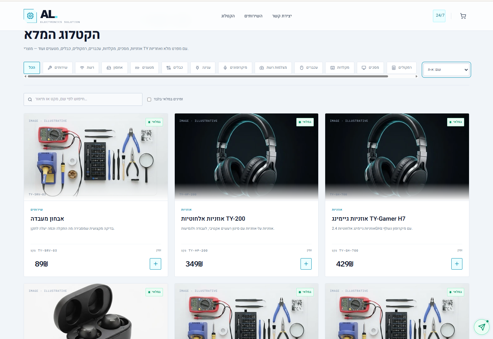
*A clean, accessible storefront with a clear call-to-action.*

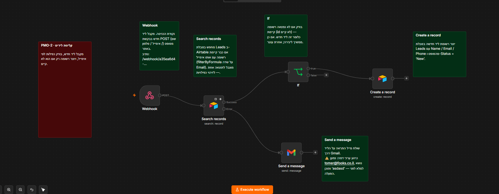
*Every submission lands in Airtable through Workflow 2 (dedup by email).*

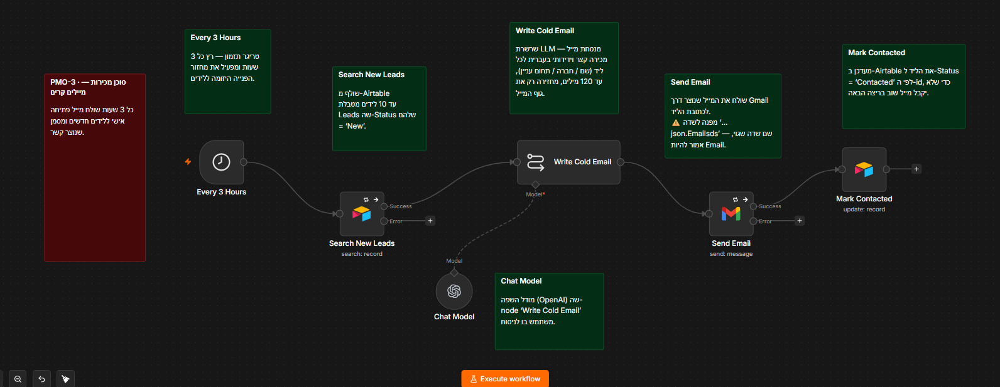
*Every 3 hours, Workflow 3 emails new leads a personal note pointing to our catalog.*

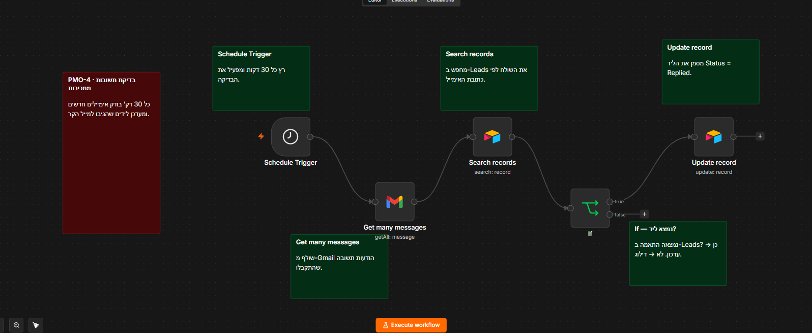
*Workflow 4 checks for replies every 30 minutes and only flags real interest for the owner — no time wasted on dead leads.*

**Closing the deal**

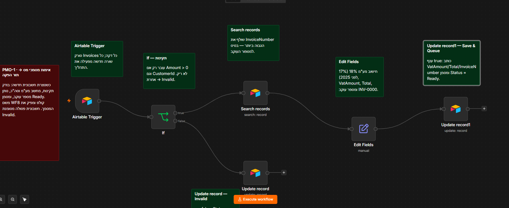
*The moment a deal closes, Workflow 8 generates the invoice automatically.*

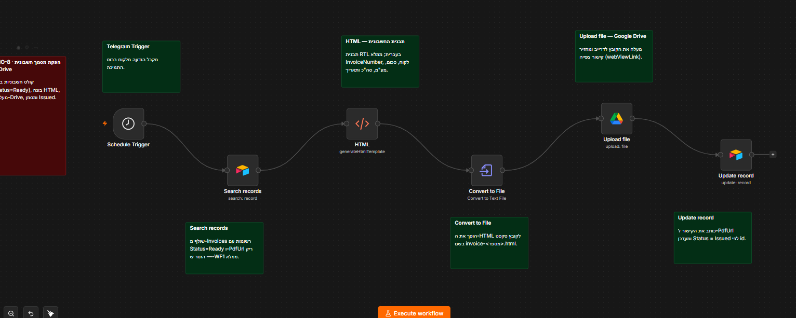
*...and sends it straight to the customer, with a link to 24/7 VIP support.*

**Customer support, 24/7**

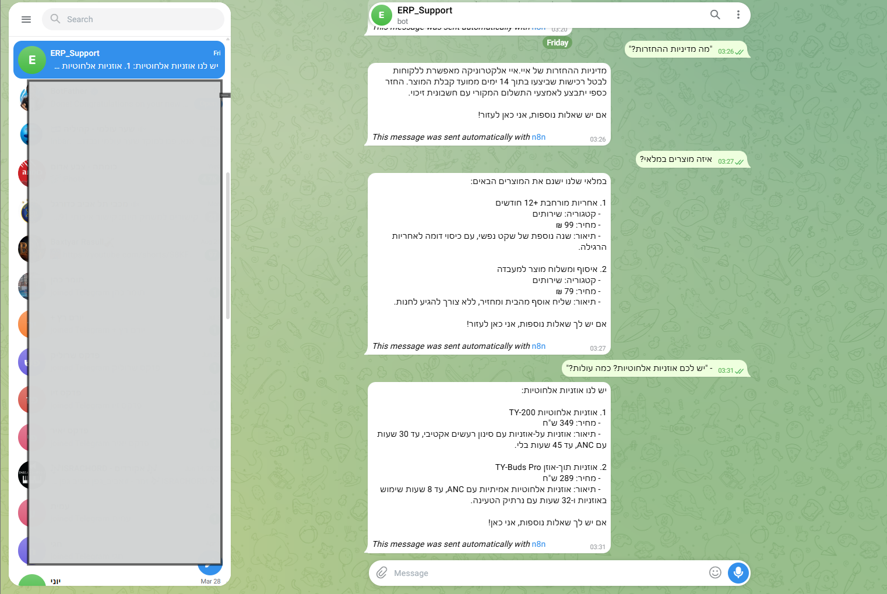
*A Telegram bot answers product and policy questions around the clock.*

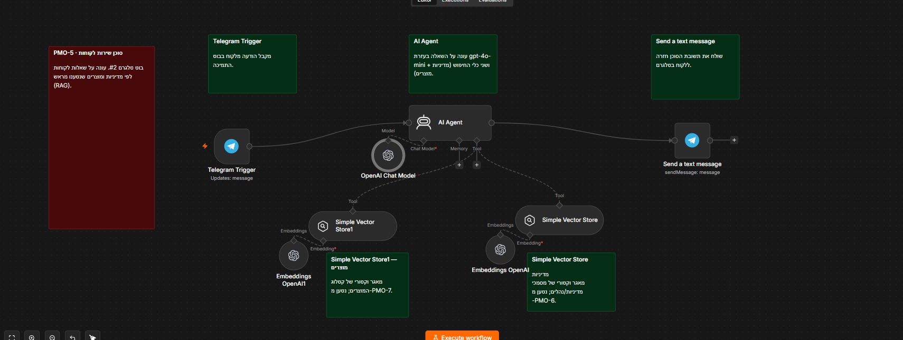
*It never guesses — every answer is grounded in the RAG vector store (Workflows 6 & 7).*

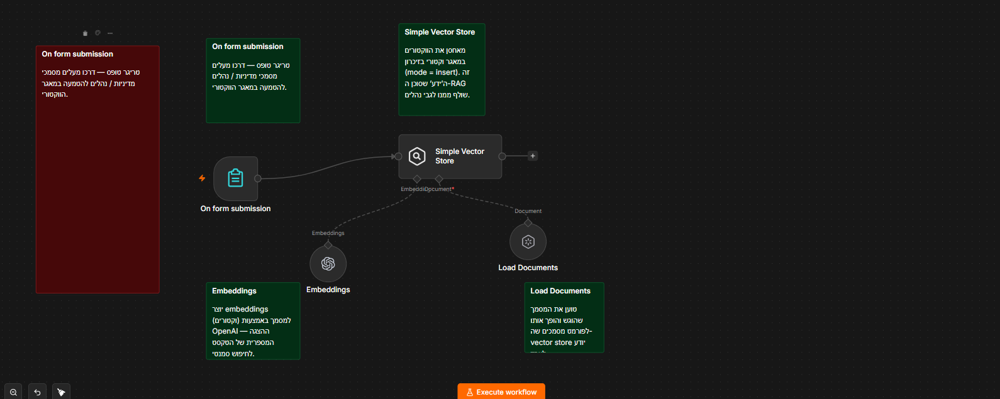
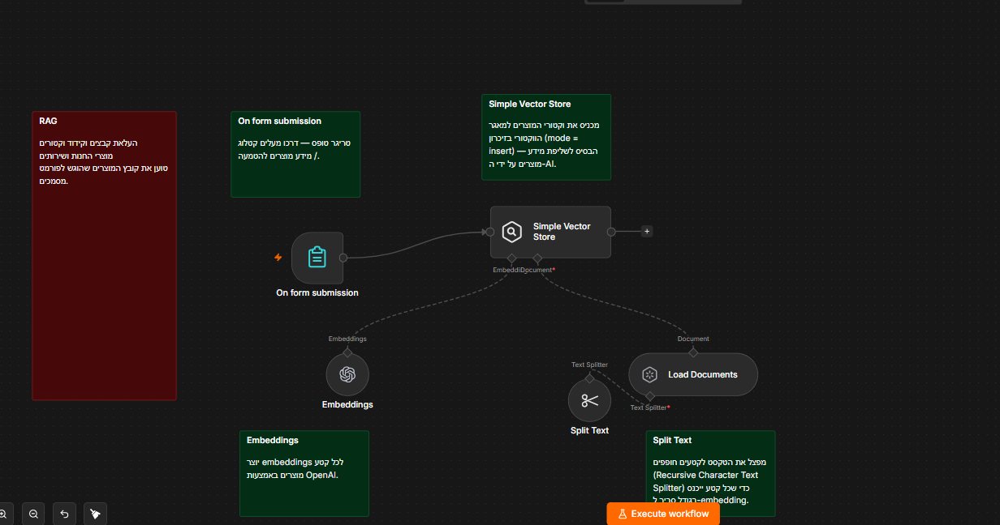

**The owner's view**

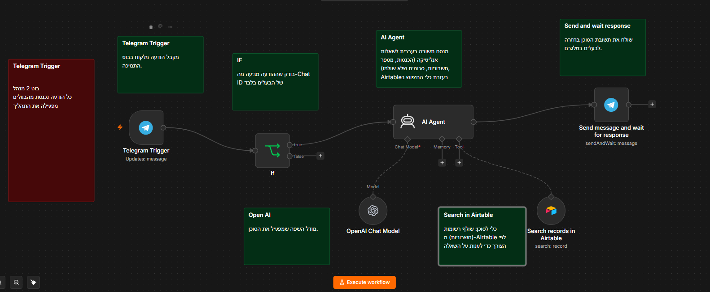
*A private Telegram bot (owner-only, gated by Chat ID) reports revenue, open invoices and unpaid customers on demand.*

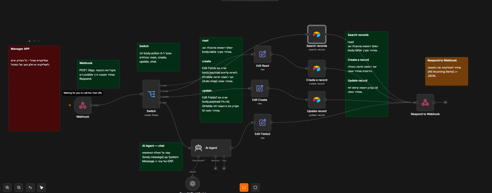
*A mobile dashboard app (Base44) surfaces leads, invoices and inventory in one screen.*

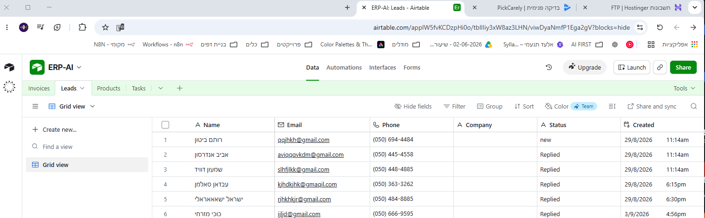
*Everything is backed by Airtable — the single source of truth behind every screen above.*

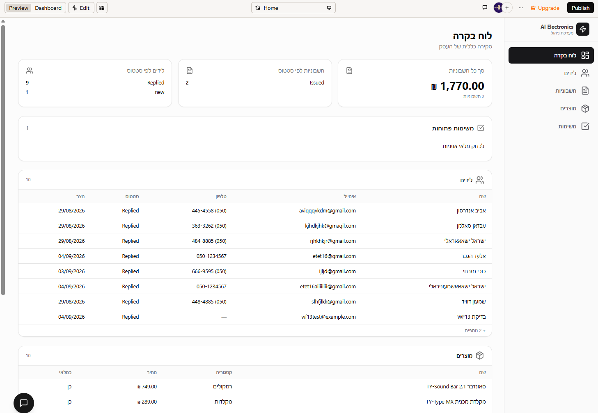
*The dashboard talks to n8n through one webhook (Workflow 13), routed by action: read / create / update / chat.*

## Data model

Four Airtable tables back the 10 workflows (of a fuller 14-table model in the brief):

| Table | Key fields |
|---|---|
| Invoices | InvoiceNumber · CustomerId · Amount · VatAmount · Total · Status · PdfUrl · Created |
| Leads | Name · Email · Company · Status · Created |
| Products | Name · Category · Price · Description · InStock |
| Tasks | Title · Status |

## External services

- **OpenAI** — chat models for the 3 agents, embeddings for RAG
- **Airtable** — the database
- **Telegram** — two bots (owner-only manager bot, public customer-service bot)
- **Gmail** — sending cold emails, reading replies
- **Google Drive** — invoice document storage
- **Base44** — the front-end (store + admin dashboard), talks to n8n via one webhook

## Known limitations (by design, for simplicity)

- The RAG vector store lives in n8n's memory — it resets on every n8n restart; re-run workflows 6 and 7 afterwards.
- No PDF conversion service — invoices are saved as HTML; converting to PDF is one manual click (Drive → Open with Google Docs → Download → PDF).
- No retries / error handling — a failed run shows red in n8n's Executions log by design, so it stays easy to read.
- The Manager agent only sees invoices up to a reasonable page size and does not create tasks on its own.

## Layout

```
workflows/               exported JSON for all 10 published workflows (safe to commit — no secrets)
docs/images/              screenshots used in this README
docs/                     architecture notes, Airtable schema, VAT rules
final-project-spec.docx   the course brief
docker-compose.yml        isolated n8n-final instance definition (design reference; not the running instance)
.env.example              template for the isolated instance, if reintroduced later
Caddyfile.snippet         reverse-proxy block for the host Caddy, if reintroduced later
```

n8n workflow exports reference credentials by name/ID only — no secrets — so
they are safe to commit. Real secrets always stay in n8n's credential store,
never in this repo.
